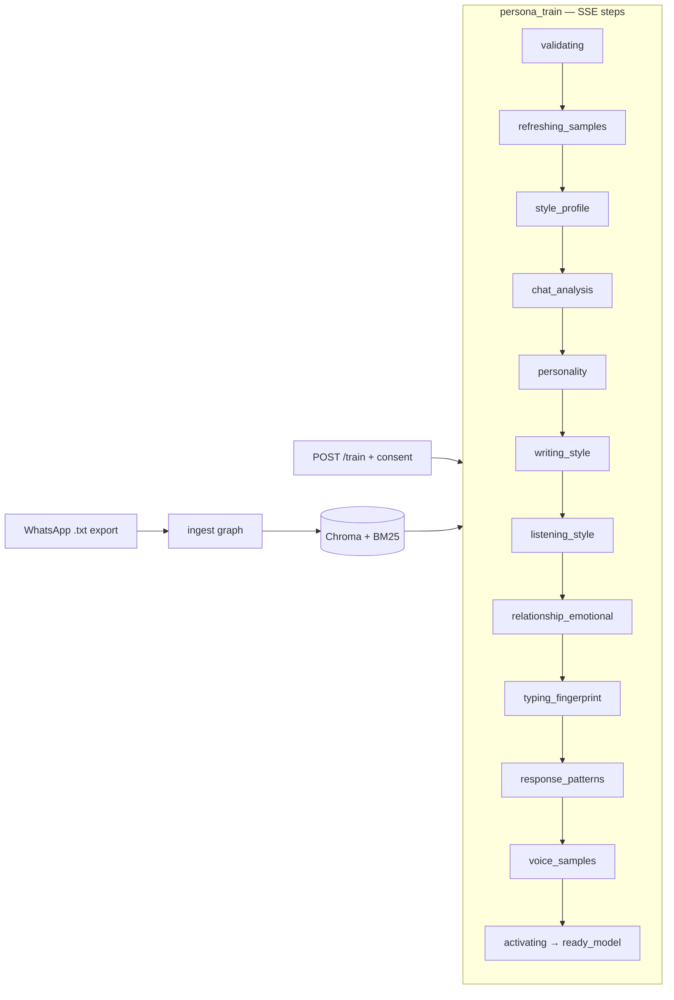
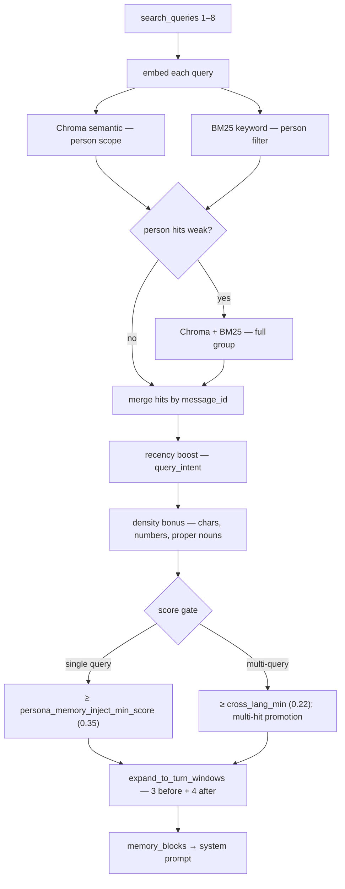

# ChatMemory

**Persona chat from WhatsApp exports** — local-first RAG over group chat history, grounded Q&A with citations, and per-speaker Gemini style mimic with optional memory recall. Hinglish and English.

## Architecture

```
┌──────────────────┐     REST + SSE      ┌─────────────────────────────┐
│  Next.js :3000   │ ──────────────────► │  FastAPI :8000              │
│  (browser UI)    │                     │  LangGraph · services       │
└──────────────────┘                     └───────────┬─────────────────┘
                                                   │
                     ┌─────────────────────────────┼─────────────────────────────┐
                     │                             │                             │
                     ▼                             ▼                             ▼
            ┌────────────────┐           ┌────────────────┐           ┌────────────────┐
            │  ./data/       │           │  Chroma        │           │  Google Gemini │
            │  workspaces    │           │  per workspace │           │  (API)         │
            └────────────────┘           └────────────────┘           └────────────────┘
                                                   │
                                                   ▼
                                          ┌────────────────┐
                                          │  CUDA / CPU    │
                                          │  e5-large embed│
                                          └────────────────┘
```

| Layer | Choice |
|-------|--------|
| Frontend | Next.js (App Router), pnpm, TanStack Query, Zod |
| Backend | FastAPI, uv, LangGraph |
| Reads / Q&A | Chroma + `multilingual-e5-large` + hybrid BM25 + Gemini rerank/generate |
| Persona | Gemini activation (style profile + samples) + optional memory recall at chat time |
| Embeddings | `intfloat/multilingual-e5-large` via sentence-transformers (CUDA or CPU) |
| Data | `./data/` at repo root (gitignored) |
| UI | Neo-brutalism, dark mode only |

Four LangGraph pipelines: **ingest**, **qa**, **persona_train**, **persona_chat**. Full detail: [docs/architecture.md](./docs/architecture.md).

## Quick start

**Prerequisites:** [uv](https://docs.astral.sh/uv/) (Python 3.12+), [Node.js](https://nodejs.org/) 20+, [pnpm](https://pnpm.io/), and a [Gemini API key](https://aistudio.google.com/apikey).

**Terminal 1 — backend**

```bash
cd backend
cp .env.example .env
# Set GEMINI_API_KEY in .env
uv sync
uv run uvicorn app.main:app --reload --port 8000
```

**Terminal 2 — frontend**

```bash
cd frontend
cp .env.local.example .env.local
pnpm install
pnpm dev
```

Open [http://localhost:3000](http://localhost:3000). API base: `http://127.0.0.1:8000/api/v1`.

Set `NEXT_PUBLIC_API_URL=http://127.0.0.1:8000/api/v1` in `frontend/.env.local`.

Full setup (CUDA, Windows ML policy, pre-commit, troubleshooting): [COMMANDS.md](./COMMANDS.md).

## Persona chat flow

Two compiled graphs in `backend/app/graphs/persona_chat.py`, orchestrated by the persona chat service. Style comes from activation fields; retrieved excerpts go in `=== RELEVANT PAST CHAT ===` only.

```mermaid
flowchart TD
    subgraph ingress["Request"]
        UM[User message + history]
    end

    subgraph context["Context graph — run_persona_context"]
        FR[fast_route]
        PM[prepare_memory_route]
        CL[classify — Gemini JSON]
        RW[maybe_rewrite_query — Gemini]
        RT[retrieve — hybrid search + turn windows]
        SK[skip_retrieve — empty memory]
    end

    subgraph service["Service layer"]
        SP[build_system_prompt]
        HW[history window + optional summary]
    end

    subgraph gen["Generation graph — run_persona_generation"]
        GR[generate_reply — Gemini]
        VF[validate_factual_claims — Gemini JSON]
        RS[regenerate_safe — max 1 retry]
    end

    subgraph stream["SSE stream + thinking panel"]
        ST[stage events: route · classify · rewrite · retrieve · generate]
        RP[reply tokens + optional || burst split]
    end

    UM --> FR
    FR -->|casual| SK
    FR -->|memory| PM
    FR -->|ambiguous| CL
    PM --> RW
    CL -->|needs_history| RW
    CL -->|no| SK
    RW --> RT
    SK --> SP
    RT --> SP
    SP --> HW
    HW --> GR
    GR --> VF
    VF -->|hallucination, attempt 0| RS
    VF -->|ok or already retried| RP
    RS --> RP

    FR -.-> ST
    CL -.-> ST
    RW -.-> ST
    RT -.-> ST
```

**Router branches**

| Route | Trigger | Retrieval |
|-------|---------|-----------|
| `casual` | "ok", "lol", emoji-only, short reactions | Skipped |
| `memory` | "yaad", "kab tha", "what did we", etc. | `prepare_memory_route` → rewrite → person-first hybrid → group fallback if weak |
| `ambiguous` | Everything else | Gemini classify → optional rewrite → retrieve or skip |

Every turn runs the router (no memory skip on follow-ups). Node detail: [docs/langgraph/persona-chat.md](./docs/langgraph/persona-chat.md).

**Thinking panel (SSE)** — streamed persona chat emits `{"status":"thinking"}` then `type: stage` events (`route`, `classify`, `rewrite`, `retrieve`, `generate`) before reply tokens. The UI accordion shows live pipeline progress; `debugMeta` on `done` carries routing decisions. Toggle via ⚙ or `thinking_show_input` in backend config.

## Persona training pipeline

WhatsApp export is ingested first (parse → embed → Chroma). Training activates a Gemini persona from indexed messages.



Gemini extraction steps (`chat_analysis` through `voice_samples`) are **non-fatal** — failures log a warning and activation continues. Build-time Gemini calls share a 14 RPM / 100k TPM rate limiter. Detail: [docs/langgraph/persona-train.md](./docs/langgraph/persona-train.md).

## Retrieval scoring (persona memory)

Persona chat uses `fast_retrieve()` — no LLM rerank (unlike Q&A). Scoring runs per query; multi-query mode supports cross-language Hinglish↔English.



**Multi-query (cross-language)** — classify returns 2–4 context-resolved phrases; `maybe_rewrite_query` adds 2–3 Gemini variations and **interleaves** them with classify queries (`rewrite[0], classify[0], …`, original anchor, cap 8). Each phrase is embedded and searched independently; hits merge by `message_id` (best score wins).

**`query_intent`** (classify, or `current` on memory fast-path) sets recency after merge:

| Intent | Recent (≤30d) | 31–90d | Older (>180d) |
|--------|---------------|--------|---------------|
| `current` | +0.10 | +0.05 | — |
| `historical` | −0.03 | — | +0.05 |
| `neutral` | +0.05 | +0.02 | — |

**Density** (language-agnostic, on chunk text): +0.03 if >100 chars, +0.02 if >200 chars or has digits or capitalised proper nouns, +0.01 if 3+ messages; −0.04 if <30 chars. Range [−0.04, +0.06]; re-sort after apply.

**Score gates** (config in `backend/app/core/config.py`):

| Mode | Threshold | Notes |
|------|-----------|-------|
| Single query | `persona_memory_inject_min_score` (0.35) | Weak hits dropped before injection |
| Multi-query | `persona_memory_inject_min_score_cross_lang` (0.22) | Lower floor for Hinglish↔English cosine gap |
| Multi-hit | `max(0.22 × 0.65, 0.10)` | Same message in 2+ query result sets |

`expand_to_turn_windows` re-applies the matching gate so borderline cross-lang hits are not dropped twice.

## Project layout

| Path | Role |
|------|------|
| `backend/app/` | FastAPI routes, LangGraph graphs, services, prompts |
| `frontend/src/` | Next.js App Router, neo-brutalism UI, TanStack Query |
| `docs/` | Architecture, API, LangGraph flows, design system |
| `data/` | Runtime workspaces, Chroma, exports — **gitignored** |
| `graphify-out/` | Local codebase knowledge graph — **gitignored** |

Package-level notes: [backend/README.md](./backend/README.md), [frontend/README.md](./frontend/README.md).

## Codebase exploration (graphify)

Build a local knowledge graph for architecture navigation:

```bash
uv tool install graphifyy   # one-time
/graphify .                 # from repo root
graphify query "How does persona chat retrieval work?"
```

Setup and commands: [docs/graphify.md](./docs/graphify.md). Agent rule: [.cursor/rules/graphify.mdc](./.cursor/rules/graphify.mdc).

## Documentation

| Doc | Contents |
|-----|----------|
| [docs/README.md](./docs/README.md) | Documentation index and build order |
| [CONTEXT.md](./CONTEXT.md) | Domain terms, locked decisions, stack |
| [AGENTS.md](./AGENTS.md) | Agent workflow, layout, dev commands |
| [docs/architecture.md](./docs/architecture.md) | System overview, data flows, GPU strategy |
| [docs/api.md](./docs/api.md) | REST + SSE contract |
| [docs/ui-design.md](./docs/ui-design.md) | Neo-brutalism design system |
| [docs/data-layout.md](./docs/data-layout.md) | On-disk schema under `./data/` |
| [docs/langgraph/](./docs/langgraph/) | Ingest, Q&A, persona train, persona chat |
| [docs/graphify.md](./docs/graphify.md) | Knowledge graph setup |

## License & disclaimer

ChatMemory is for **personal, local use** on your own machine. Chat exports stay on disk; only Gemini API calls leave the machine (Q&A, persona build, persona chat).

No warranty. You are responsible for consent when building personas from real conversations. Examples in this repo use fictional workspace and speaker names only.
