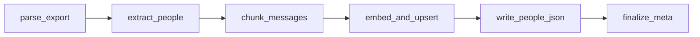

# LangGraph — Ingest

Parses WhatsApp export, extracts speakers, chunks messages, embeds with bge-m3, upserts Chroma.

**Trigger:** `POST /workspaces` (multipart upload)  
**Execution:** Background job + SSE  
**Graph file:** `backend/app/graphs/ingest.py`

---

## State schema

```python
class IngestState(TypedDict):
    job_id: str
    workspace_id: str
    export_path: str
    messages: list[Message]          # filled by parse
    people: dict[str, PersonDraft]  # keyed by normalized speaker name
    chunks: list[Chunk]              # filled by chunk
    error: str | None
    percent: int
    step: str
```

---

## Graph flow



---

## Nodes

### 1. `parse_export`

- Read `export.txt` from workspace folder
- Run WhatsApp parser (see [../ingest/whatsapp-export.md](../ingest/whatsapp-export.md))
- Validate: ≥ 50 messages total, ≥ 1 speaker
- On failure: set `error`, job → `error`

**Output:** `messages` list ordered by timestamp

### 2. `extract_people`

- Group messages by speaker display name
- Assign stable `personId` UUID per unique speaker
- Compute per-person: `messageCount`, `firstSeen`, `lastSeen`
- Build initial `styleProfile` (avg length, emoji rate, hinglish heuristic)
- Pick up to 10 `sampleMessages` (diverse lengths / dates)

### 3. `chunk_messages`

- **1 message = 1 chunk** (keep Hinglish lines intact)
- Each chunk: `messageId`, `personId`, `speaker`, `timestamp`, `text`
- Do not split multiline messages that belong to one WA entry

### 4. `embed_and_upsert`

- Acquire `gpu_lock`
- Load `bge-m3` on CUDA
- Batch embed (tune batch size for 6GB — start 32)
- Upsert into Chroma collection `workspace_{id}`
- Build BM25 index in parallel on CPU → save under `bm25/`
- Release lock
- Update `percent` per batch for SSE

### 5. `write_people_json`

- Write `people/{personId}.json` for each speaker
- Set `personaStatus`: `not_enough` / `thin` / `ready` based on message count

### 6. `finalize_meta`

- Update `meta.json`: counts, date range, `ingestStatus: done`
- Job → `done`

---

## SSE steps

| Step | Typical % |
|------|-----------|
| `parsing` | 0–15 |
| `extracting_people` | 15–25 |
| `chunking` | 25–30 |
| `embedding` | 30–95 |
| `finalizing` | 95–100 |

---

## Error handling

| Error | User message |
|-------|----------------|
| Unparseable file | "Not a valid WhatsApp export" |
| Too few messages | "Need at least 50 messages" |
| CUDA OOM | "GPU out of memory — close other apps and retry" |
| Chroma write fail | "Index write failed" |

---

## Idempotency

Re-ingest same workspace (future): delete collection + bm25, re-run graph. MVP: delete workspace and recreate.

---

## Related

- [../ingest/whatsapp-export.md](../ingest/whatsapp-export.md)
- [../data-layout.md](../data-layout.md)
- [qa.md](./qa.md)
