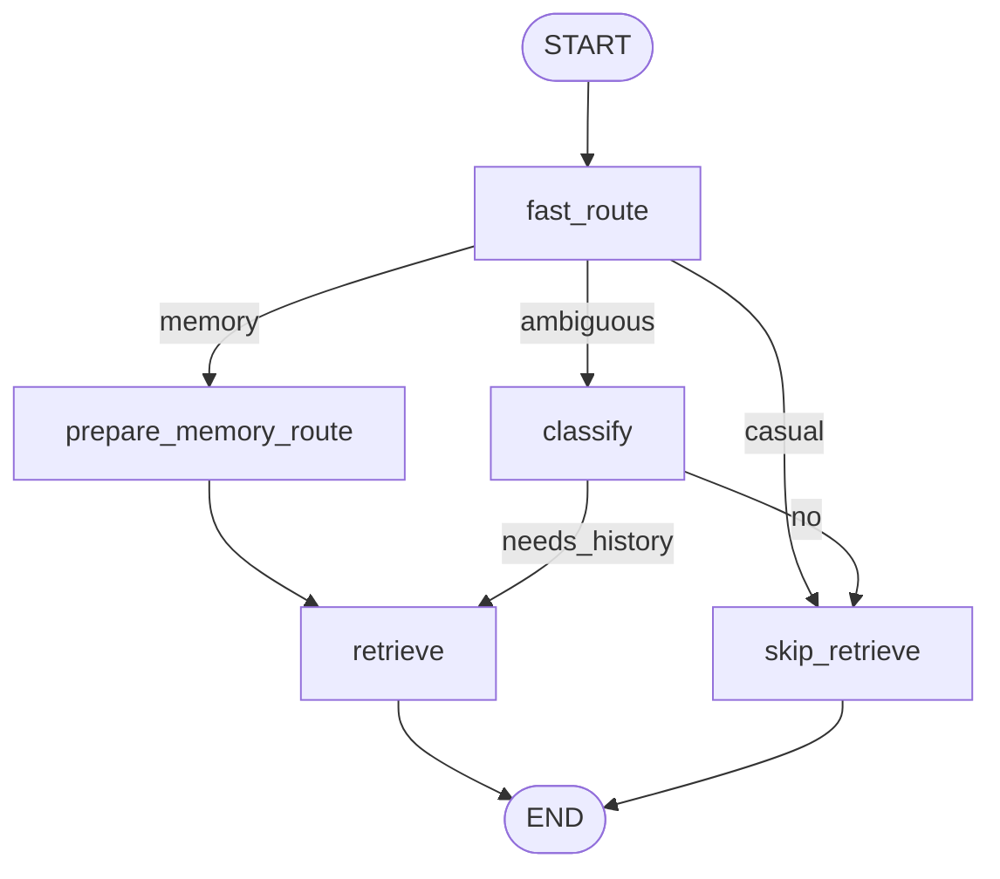
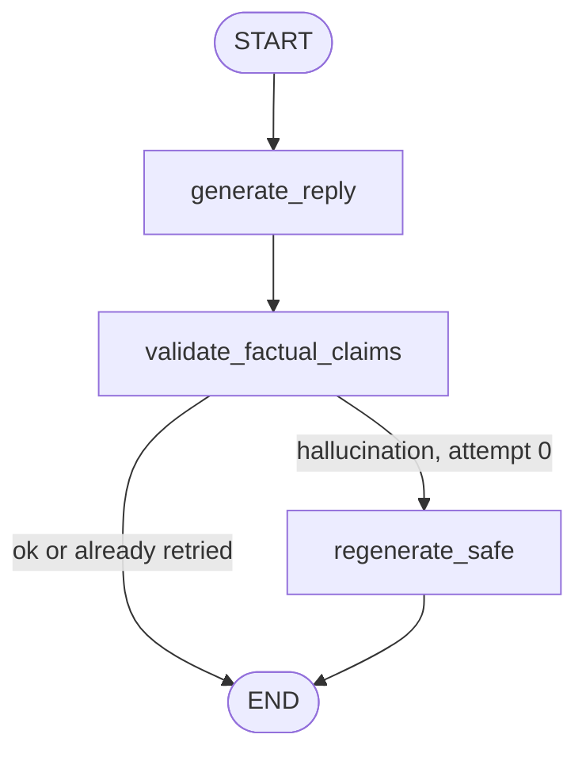

# LangGraph — Persona chat (memory recall + generation)

Style-mimic replies with optional **factual memory recall** from indexed WhatsApp history. Two compiled graphs: context routing/retrieval, then generation with hallucination guard.

**Trigger:** `POST /workspaces/{id}/people/{pid}/chat` or `.../chat/stream`  
**Execution:** Synchronous (seconds; extra Gemini calls on ambiguous route or validation retry)  
**Graph file:** `backend/app/graphs/persona_chat.py`  
**Orchestration:** `backend/app/services/persona_chat.py` (system prompt, history window, SSE)

---

## Principles

1. **Style from activation** — personality, writing style, chat analysis, and style samples drive voice (not memory blocks).
2. **Memory in `=== RELEVANT PAST CHAT ===`** — retrieved excerpts are factual context only; never mixed into style samples.
3. **Every turn runs the router** — no skip on follow-ups; `previousInteractionId` chains Gemini only.
4. **No invented facts** — HARD RULES in system prompt; validation node + one safe regeneration on hallucination.
5. **Vague when unsure** — "yaad nahi", "pata nahi" preferred over fabricated stories.

---

## Graph 1 — Context (`run_persona_context`)

Two-stage **router B**: fast heuristics first; Gemini JSON classify only when ambiguous.



### Nodes

| Node | Role |
|------|------|
| `fast_route` | `history_router.fast_history_route()` — casual / memory / ambiguous |
| `prepare_memory_route` | Sets `needs_history=true`, `search_query=user_message` |
| `classify` | `history_router.classify_history_need()` — Gemini JSON when ambiguous |
| `retrieve` | `retrieval.fast_retrieve()` + `expand_to_turn_windows()` |
| `skip_retrieve` | Empty `memory_blocks` |

### Fast route heuristics (`history_router.py`)

| Route | Examples |
|-------|----------|
| `casual` | "ok", "lol", emoji-only, very short reactions |
| `memory` | "yaad", "remember", "kab tha", "what did we", "us din" |
| `ambiguous` | Everything else → Gemini classify |

### Retrieval (`retrieval.py`)

Person-first hybrid search (no LLM rerank):

1. Chroma semantic + BM25, filtered to target **person** (`person_id` / display name).
2. **Group fallback** when person hits are weak (`persona_retrieve_weak_threshold`, `persona_retrieve_min_strong_hits`, `persona_retrieve_strong_score`).
3. **Score gate** — hits below `persona_memory_inject_min_score` (default **0.35**) dropped before injection.
4. **`expand_to_turn_windows()`** — read `export.txt` timeline; **3 messages before + 2 after** each hit; max `persona_memory_max_blocks` blocks.
5. **`target_person` filter** — drop windows that don't mention or include the persona speaker.

Sync only in `_node_retrieve` — no `asyncio.run` or `gpu_lock` inside the graph (embed uses sync path).

---

## Graph 2 — Generation (`run_persona_generation`)



### Nodes

| Node | Role |
|------|------|
| `generate_reply` | Gemini persona reply (`temperature` ~0.85) |
| `validate_factual_claims` | Second Gemini call — JSON `{has_hallucination, reason}` vs memory + conversation |
| `regenerate_safe` | One retry with STRICT RECALL prefix + lower temperature; max **1** retry |

Validation **fails safe** (no flag) on JSON/API errors so chat never crashes.

---

## End-to-end (service layer)

```
message + history (+ conversationSummary, previousInteractionId)
  → run_persona_context (router + optional retrieval)
  → build_system_prompt (style fields + RELEVANT PAST CHAT + HARD RULES)
  → history window (up to 30 turns, fallback 20 on char budget)
  → run_persona_generation (generate → validate → optional regenerate)
  → reply (+ interactionId for Gemini chain)
```

Rolling summarization unchanged: client calls `/chat/summarize` when history &gt; 24 turns; keeps last 10 verbatim.

---

## Index noise filter

`parser/whatsapp.py` — `is_noise_message()` drops media omitted, deleted markers, attachment omitted, blank lines. `non_system_messages()` applies at index/read time. Raw `export.txt` on disk is unchanged.

BM25 index cached per workspace (`bm25.py`); invalidated on ingest via `clear_index_cache()`.

---

## Tuning (config)

| Key | Default | Purpose |
|-----|---------|---------|
| `persona_retrieve_top_k` | 8 | Top hits per search leg |
| `persona_retrieve_weak_threshold` | 0.32 | Max person score below → widen to group |
| `persona_retrieve_min_strong_hits` | 2 | Min strong person hits to stay person-only |
| `persona_retrieve_strong_score` | 0.25 | "Strong" hit threshold |
| `persona_memory_window_before` | 3 | Messages before hit in window |
| `persona_memory_window_after` | 2 | Messages after hit in window |
| `persona_memory_max_blocks` | 5 | Max injected excerpt blocks |
| `persona_memory_inject_min_score` | 0.35 | Min similarity to inject a hit/window |

---

## Related

- [../architecture.md](../architecture.md) — persona chat data flow
- [../api.md](../api.md#persona-chat-json) — HTTP contract (unchanged fields)
- [persona-train.md](./persona-train.md) — activation / style profile build
- [qa.md](./qa.md) — strict grounded Q&A (separate graph, stricter refusal)
- [../decisions.md](../decisions.md) — ADR-026
