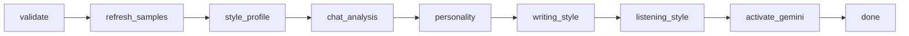

# LangGraph — Persona train (Gemini activation)

Build a speaker's style profile, run build-time LLM analysis, and activate Gemini persona chat.

**Trigger:** `POST /workspaces/{id}/people/{pid}/train`  
**Execution:** Background job + SSE  
**Graph file:** `backend/app/graphs/persona_train.py`

No GPU LoRA training — activation is style profile + samples + Gemini-extracted notes.

---

## Preconditions

| Check | Rule |
|-------|------|
| Consent | `consent: true` in request body |
| Gemini | `GEMINI_API_KEY` set in backend `.env` |
| Message count | ≥ 50 (block below); 50–199 needs `forceThin: true` |
| Recommended | ≥ 200 messages |
| Status | not already `training`; use `forceRetrain: true` if already `ready_model` |

---

## Graph flow

### Steps (SSE `step` values)

| Step | Percent | Description |
|------|---------|-------------|
| `validating` | 5 | Check Gemini config and indexed messages |
| `refreshing_samples` | 15 | Re-pick sample messages (recency-biased monthly spread) |
| `style_profile` | 40 | Compute avg length, emoji rate, Hinglish ratio from full export |
| `chat_analysis` | 55 | Chunked Gemini analysis → `chatAnalysis` on person record |
| `personality` | 65 | Gemini personality keynote → `personalityNotes` |
| `writing_style` | 75 | Gemini typing-habit extract → `writingStyleNotes` |
| `listening_style` | 80 | Gemini reactive-pattern extract → `activeListeningStyle` |
| `activating` | 88 | Set `personaStatus: ready_model`, store model tag |
| `done` | 100 | Persona ready for chat |

`chat_analysis`, `personality`, `writing_style`, and `listening_style` are **non-fatal** — failures log a warning and activation continues with whatever notes were produced.

### Rate limiting

Build-time Gemini calls (`chat_analysis`, `personality`, `writing_style`, `listening_style`, and multi-chunk consolidation) share `GeminiRateLimiter`: **14 RPM**, **100k TPM** sliding window (`services/rate_limit.py`).

### Recency-weighted sampling

Personality, writing-style, and listening-style extraction sample up to 60 messages with **60% of slots from the most recent third** of the corpus (`_recency_weighted_sample` in `workspace.py`). Chat analysis processes the full corpus in ~200-message chunks.

---

## Stored fields (person JSON)

| API field (camelCase) | Purpose |
|-----------------------|---------|
| `personalityNotes` | Who they are — communication style, humour, themes |
| `writingStyleNotes` | How they type — casing, punctuation, abbreviations, emoji |
| `chatAnalysis` | Deep patterns — vocabulary, topics, tone, dynamics |
| `activeListeningStyle` | How they listen/react when others share problems or news |

All four fields are injected into the persona chat system prompt at runtime.

---

## Persona chat

| Endpoint | Role |
|----------|------|
| `POST .../chat` | Single JSON reply (bursts collapsed) |
| `POST .../chat/stream` | SSE with optional `||` burst bubbles |
| `POST .../chat/summarize` | Rolling history compression when &gt; 24 turns |

Memory recall and validation run server-side via `persona_chat` LangGraph — see [persona-chat.md](./persona-chat.md). Request/response fields unchanged; see [../api.md](../api.md#persona-chat-json) for `conversationSummary`, `previousInteractionId`.

`ollamaModelName` in person JSON stores the Gemini model tag (legacy field name; no Ollama involved).

---

## Cancel

`POST .../train/cancel` — cancels in-flight job, restores prior persona status.

---

## Failure modes

| Condition | Behavior |
|-----------|----------|
| No Gemini key | fail at `validating` |
| No indexed messages | fail — re-ingest workspace |
| LLM extraction step fails | warning logged; step skipped |
| Job error | `personaStatus: error` |

---

## See also

- [../data-layout.md](../data-layout.md) — people JSON
- [../architecture.md](../architecture.md) — persona chat flow
- [persona-chat.md](./persona-chat.md) — memory recall + generation graphs
- [qa.md](./qa.md) — grounded Q&A (separate from persona chat)
