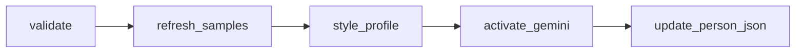

# LangGraph — Persona train (Gemini activation)

Build a speaker's style profile and activate Gemini persona chat.

**Trigger:** `POST /workspaces/{id}/people/{pid}/train`  
**Execution:** Background job + SSE  
**Graph file:** `backend/app/graphs/persona_train.py`

---

## Preconditions

| Check | Rule |
|-------|------|
| Consent | `consent: true` in request body |
| Gemini | `GEMINI_API_KEY` set in backend `.env` |
| Message count | ≥ 50 (block below); 50–199 needs `forceThin: true` |
| Recommended | ≥ 200 messages |
| Status | not already `training` |

---

## Graph flow

### Steps (SSE `step` values)

| Step | Percent | Description |
|------|---------|-------------|
| `validating` | 5 | Check Gemini config and indexed messages |
| `refreshing_samples` | 15 | Pick representative messages for the speaker |
| `style_profile` | 45 | Compute avg length, emoji rate, Hinglish ratio |
| `activating` | 85 | Set persona status to `ready_model` with provider `gemini` |
| `done` | 100 | Persona ready for chat |

---

## Persona chat

`POST .../people/{pid}/chat` → FastAPI builds a Gemini system prompt from style profile + samples + optional RAG context, then streams or returns a reply.

`ollamaModelName` in person JSON is set to `"gemini"` (legacy field name; no Ollama involved).

---

## Retrain

Same graph. Set `forceRetrain: true` to rebuild an already-active persona.

---

## Failure modes

| Condition | Behavior |
|-----------|----------|
| No Gemini key | fail at `validating` |
| No indexed messages | fail — re-ingest workspace |
| Job error | `personaStatus: error` |

---

## See also

- [../data-layout.md](../data-layout.md) — people JSON
- [qa.md](./qa.md) — grounded Q&A (separate from persona chat)
