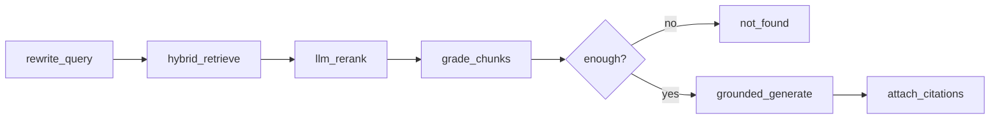

# LangGraph — Q&A (RAG)

Grounded question answering over workspace chat history. **Strict mode** — refuses when retrieval is weak.

**Trigger:** `POST /workspaces/{id}/ask`  
**Execution:** Synchronous (seconds)  
**Implementation:** `backend/app/graphs/qa.py` → `backend/app/services/rag_chain.py`

---

## Principles

1. **No hallucinated history** — if chunks don't support an answer, return `not_found`
2. **Citations required** — every answer backed by retrieved messages
3. **Hinglish + English** — answer in same language mix as question
4. **Gemini required** — `GEMINI_API_KEY` must be set

---

## Graph flow

---

## Nodes

### 1. `rewrite_query`

**Gemini** (via LangChain) — keep Hinglish/English mix; output one rewritten line.

### 2. `hybrid_retrieve`

| Source | Top-K | Method |
|--------|-------|--------|
| Semantic | 20 | Chroma + bge-m3 query embedding |
| Keyword | 20 | BM25 on message text |

Optional filters: `speaker`, `date_from`, `date_to`.

### 3. `llm_rerank`

**Gemini** — JSON scores 0.0–1.0 per snippet; keep top 8.

### 4. `grade_chunks`

- Threshold: **≥ 0.6**
- Need **≥ 2** passing chunks
- Else: `not_found` + `near_misses`

### 5. `grounded_generate`

**Gemini** — answer only from provided snippets; refuse if insufficient.

---

## GPU / mutex

Local embed for query vector acquires `gpu_lock`. Returns **409** if another GPU job holds the lock.

---

## Tuning (config)

| Key | Default |
|-----|---------|
| `QA_SEMANTIC_TOP_K` | 20 |
| `QA_BM25_TOP_K` | 20 |
| `QA_RERANK_TOP_K` | 8 |
| `QA_GRADE_THRESHOLD` | 0.6 |
| `QA_MIN_PASSING_CHUNKS` | 2 |

---

## Related

- [../api.md](../api.md) — ask endpoint
- [../decisions.md](../decisions.md) — ADR-013, ADR-021
